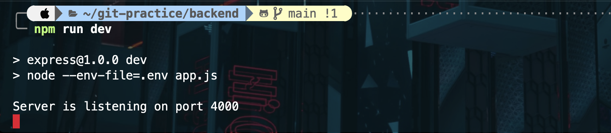

# Express 專案

## package.json 中的 dependencies 與 devDependencies 分別是什麼

- dependencies：使用在已經發布的環境下，換句話說，是指發布後仍然需要依賴使用的 plugin
- devDependencies：使用在開發中的環境下，意思是指——只單純會在開發時應用到的 plugin。

## package.json 中的 scripts 這個區塊怎麼用？

- 用來執行 npm run 指令的
- 範例如下："test" 為名稱，通常依據一些規範如dev, build, test等。
- 後面的 "node test.js" 則為實際指令，這代表在執行 `npm run test` 時，實際上是跑`node test.js`這個指令。

```
"scripts":{
    "test": "node test.js"
}
```

## Port number 要怎麼以環境變數來設定？

- 我在宣告 port 時用 `const port = process.env.PORT || 3000` 來以環境變數設定，若沒有設定則預設 Port 3000。

```
// .env
PORT=4000

// package.json
  "scripts": {
    "dev" : "node --env-file=.env app.js"
  },
```

- 執行結果：<br/>
  

### 環境變數

- 在.env 檔中設定 PORT=4000，並在 package.json 中加入 `"dev" : "node --env-file=.env app.js"`
  這樣在執行 `npm run dev` 指令時，就會用 .env 中設定的 PORT number 來執行 app.js。
- 其他方法：
  - `npm install dotnet` 並在 app.js 中 require('dotnet').config()。
  - 每次使用的時候都設定：`PORT=4000 node app.js`，或將此指令指定給 `npm run dev`。

## 哪些檔案應該要放上 github repo? 為什麼選擇上傳/不上傳某些檔案，決策的要素是什麼？

- 資安問題：如 .env 檔或任何存有密碼、個資、API Key 等資訊的檔案。
- 非必要檔案：如 node_modules 可以用 `npm install` 下載的就沒必要一起放上 repo。
- 測試用的檔案：例如某些功能測試時，可能會放測試用的檔案在 assets/ 中，這些檔案未必要放上 repo。

## CJS vs ESM，這兩者分別怎麼用？

- CJS：CommonJS 的模組系統，最初是為了在伺服器端使用 Node.js 而開發的，但也被廣泛用於前端開發。
- CJS 使用 require 導入模組，module.export 或 exports 定義導出的內容

```
// math.js
exports.add = function(a,b){
    return a+b
}

// main.js
var math = require('./main.js')
console.log(math.add(2,3))
```

- ESM：是 ECMAScript 的模組系統，從 ES6 開始成為 JS 的一部份。
- 使用 import, export 來定義和導入模組。

```
// math.js
export function add(a, b) {
  return a + b
}

// main.js
import { add } from './math.js'
console.log(add(2, 3))
```

- 差異：

1. 加載時間：ESM 是靜態加載，在編譯時就可以確定模組的依賴關係；CJS 是動態加載，在執行時依需求動態加載。
2. 運行環境：ESM 可以在現代瀏覽器中使用，但需要在 <script> 標籤上使用 type="module" 屬性；而 CJS 主要用於 Node.js 環境。
3. 預設導出：ESM 支援預設導出，可以使用 export default，而 CJS 沒有內建的預設導出機制。

### 參考資料

[package.json 需要了解的事](https://hackmd.io/@Hsuan93625/HkUdUG8zd)<br/>
[【前端工程化】配置package.json中scripts命令脚本，新手必学](https://blog.csdn.net/qq_17335549/article/details/126784270)<br/>
[【程式語言 - Javascript】 ESM與CJS](https://vocus.cc/article/649cc0e0fd89780001a7d34d)

---

# 進階

## localhost

- localhost 就是目前電腦的內部ip位址，

  - 公共ip：電腦在網路上的位址（像是電腦的門牌），由路由器或網絡提供商（ISP）分配的。這個位址是互聯網上其他設備能看到並使用的位址。
    - 可以透過 `curl ifconfig.me` 查詢，或是直接 google：what is my ip。
  - 內部ip：在本地網路（如 Wi-Fi）中的 IP，這個位址通常是 NAT（網路地址轉換）的一部分，像是 192.168.x.x 或 10.x.x.x，
    它是由路由器分配給你的設備的。
    - 這個位址僅在你所在的局域網（LAN）內部有效，外部的網絡無法直接通過這個位址訪問你。
    - 可以透過 `ipconfig getifaddr en0` 查詢。

- 在瀏覽器輸入 http://{ip} 或是 http://localhost 都會連到自己電腦上的網頁伺服器（有啟動的話）。
- Port：一台電腦可能在同時間開啟多個應用程式，從遠端伺服器送回來的資料，都會到同一個ip位置，
  要如何得知此資訊要送往哪個應用程式，就是靠port連接阜來分辨，port的數字從0–65535。[ref](https://bc-1221.medium.com/3%E5%88%86%E9%90%98%E7%B6%B2%E8%B7%AF%E5%9F%BA%E7%A4%8E-%E4%BB%80%E9%BA%BC%E6%98%AFip-port-%E9%80%A3%E6%8E%A5%E9%98%9C-68faac6ff29)
  - 常用的 Port：HTTP: 80 , HTTPS:443 , MySQL：3306

## curl
