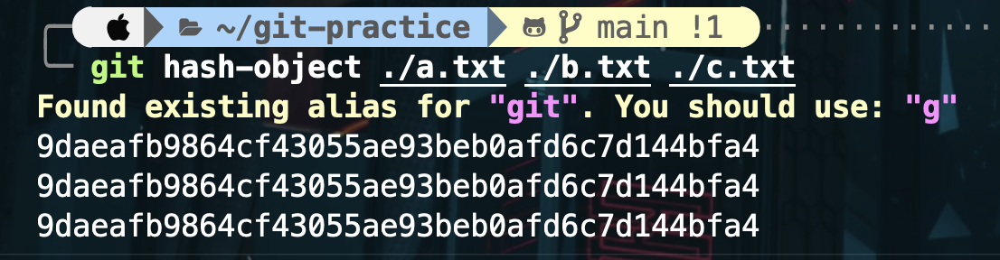

# git 物件介紹

### 1.1 blob (binary large object)

- 檔案加入git時，會被計算出一個SHA-1值，這個雜湊值會被當成blob物件的檔名儲存在.git/objects資料夾中
- SHA值前兩碼會被當作資聊夾名稱放在.git/objects中剩餘部分當作檔名放在該資料夾中
- blob物件就是某個檔案的內容

### 1.2 tree

- tree物件會儲存某個資料夾下的所有資訊，包括檔名、對應的blob物件檔案連結和其他tree物件等
- tree物件就有點類似資料夾的概念，或某個資料夾的snapshot

### 1.3 commit

- commit物件用來記錄版本資訊以及上一次commit物件名稱

### 1.4 branch

- branch是指向某個特定commit的指標，在此branch上的改動在merge回去前不會影響到原先的branch
- 通常在製作功能時，會建立新的branch出去開發，以防同一個branch上的commit太混亂，不方便版本控制

### 1.5 head

- HEAD就是指向當前branch的指標

#### 參考資料

[30 天精通 Git 版本控管](https://github.com/doggy8088/Learn-Git-in-30-days)

# .git

## 2. commit後發生什麼事

### 第一次git commit


### 第二次git commit


在第一次commit後又對git.md進行了更動，更動的部分會再被做成blob儲存在objects資料夾中，如上圖所示

## 相同檔名、相同內容

```BASH 
touch a.txt
cp a.txt b.txt
cp a.txt c.txt
```
- use `git hash-object ./a.txt ./b.txt ./c.txt` to check

- 可以看見這三個檔案的SHA值實際上是相同的，因為SHA的原理就是給相同的內容，就會生成對應的HASh值
### 那git怎麼區分這三個檔案
- 用 `git ls-treee HEAD` 可以看到當前HEAD上檔案和目錄，輸出包含（檔案權限、檔案類型、HASH值、檔案名稱）

- 可以看到相同內容的檔案，雖擁有相同HASH值，但有不同檔名，因為檔案路徑和檔案名稱都存在tree物件中(tree物件也存在.git/objects中)
- 可運用 `git cat-file -p` 查看內容和 `git cat-file -t` 查看檔案類型
### 結論
- a.txt b.txt c.txt 的檔名和路徑存在根目錄的tree物件中
- 用`git rev-parse HEAD^{tree}`可以獲得根目錄的tree物件HASH值，如下圖

- 再用`git cat-file -t` `git cat-file -p` 就可以看到檔案類別是tree以及根目錄下的內容


## commit message 怎麼寫比較好

- 在過去自己和同學的project中，我們習慣用feat/refactor/fix等title標明功能，在加上自己在這次版本做的更動，儘量簡要易懂為主
- 在branch name上的命名也會用feat/kkai0828/README 這種方式來讓其他人更快知道這個branch在做什麼
