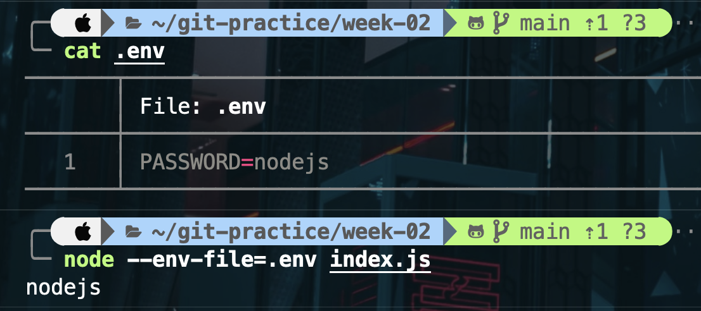

# 第二週作業說明

## Node.js 版本：v20.6.0

### 原因

- 先前在開發其他專案時所使用的版本，並沒有特別更新。
- 未來將與其他組員討論，一同決定未來使用的版本。

### v20.6.0 版本介紹

1. **.env file support**

   - 此版本的特色在於內建的 `.env` 支援。
   - 原本需要使用第三方套件如 `dotenv` 的功能，現在可直接透過 Node.js 執行。
   - 

2. **`import.meta.resolve` unflagged**

   - `import.meta.resolve(specifier)` 返回一個絕對 URL 字串，該 URL 對應於傳入的 specifier。
   - 類似於 CommonJS 中的 `require.resolve`，但對 ES 模組語法進行了優化。
   - 此功能使 Node.js 對齊其他瀏覽器及伺服器運行環境。
   - 

3. **其餘功能**
   - 待研究...

### 參考資料

[Node.js 20.6.0 版本發布說明](https://nodejs.org/zh-tw/blog/release/v20.6.0)
