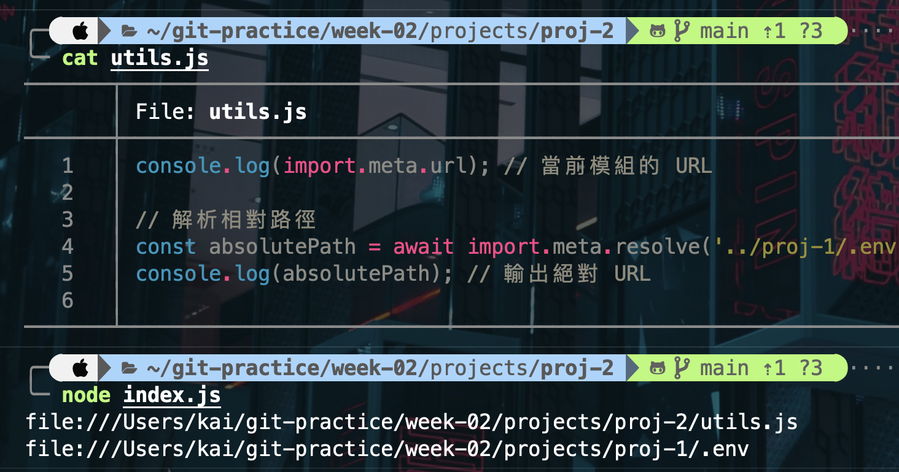

# 第二週作業說明

## Node.js 版本：v20.6.0

### 原因

- 先前在開發其他專案時所使用的版本，並沒有特別更新。
- 未來將與其他組員討論，一同決定未來使用的版本。

### v20.6.0 版本介紹

1. **.env file support**

   - 此版本的特色在於內建的 `.env` 支援。
   - 原本需要使用第三方套件如 `dotenv` 的功能，現在可直接透過 Node.js 執行。
   - Node.js v20.6.0 .env 支援 <br/>
     

2. **`import.meta.resolve` unflagged**

   - `import.meta.resolve(specifier)` 返回一個絕對 URL 字串，該 URL 對應於傳入的 specifier。
   - 類似於 CommonJS 中的 `require.resolve`，但對 ES 模組語法進行了優化。
   - 此功能使 Node.js 對齊其他瀏覽器及伺服器運行環境。
   - `import.meta.resolve` 獲取絕對路徑 <br/>
     

3. **其餘功能**
   - 待研究...

#### [參考資料](https://nodejs.org/zh-tw/blog/release/v20.6.0)

## npm (Node.js package manager)

- npm 是Node.js的package管理器。
- npm 可以讓開發人員輕鬆安裝和管理專案所用到的packages以及dependencies。
- e.g. 使用`npm install react`來下載react
- e.g. 使用`npm list`列出目前安裝的node module

## nvm (Node.js version manager)

- nvm 用於管理Node.js的版本
- 開發人員可以利用nvm管理單台機器上的多個Node.js版本，確保不同項目的兼容性
- 常用指令:

```Shell
下載指定版本的Node
$ nvm install <version>
查看可安裝的版本
$ nvm ls-remote
查看已安裝的版本
$ nvm ls
使用指定版本
$ nvm use v10.6.3
查看目前使用版本
$ nvm current
```

#### 參考資料

[什麼是 nvm、npm、Node.js | Javascript](https://benzhub.github.io/post/javascript/023-whats-nvm-npm-nodejs/)
[nvm 常見使用](https://titangene.github.io/article/nvm.html)
