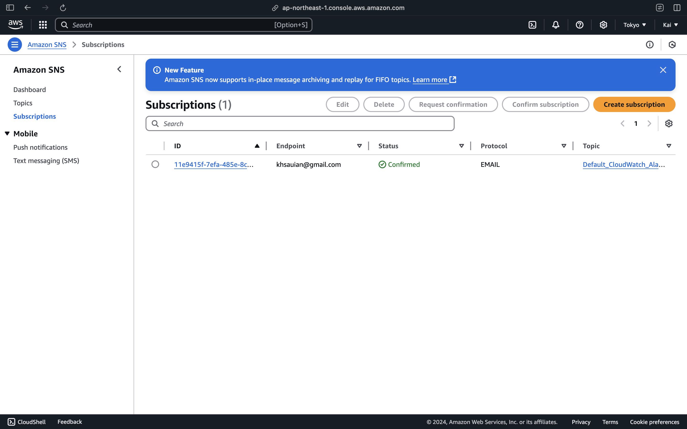
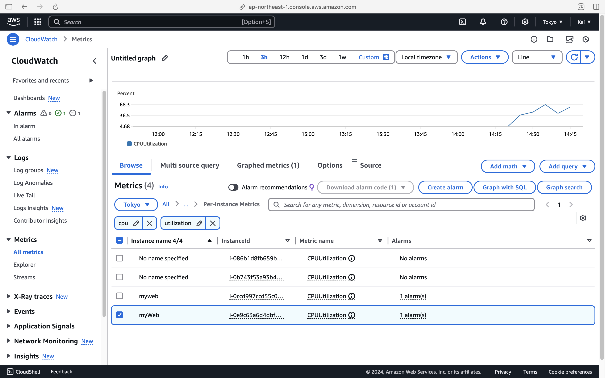
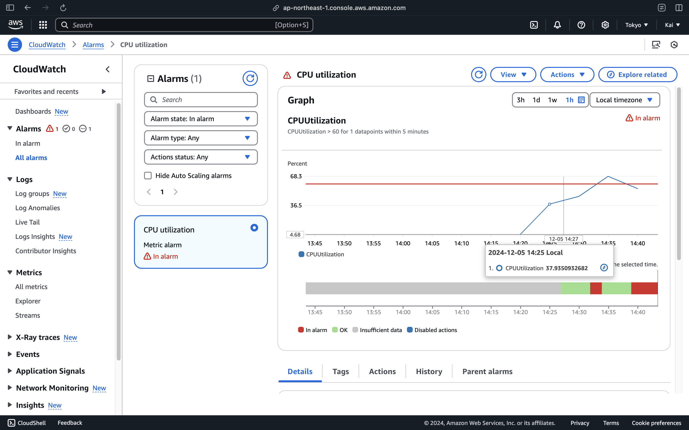
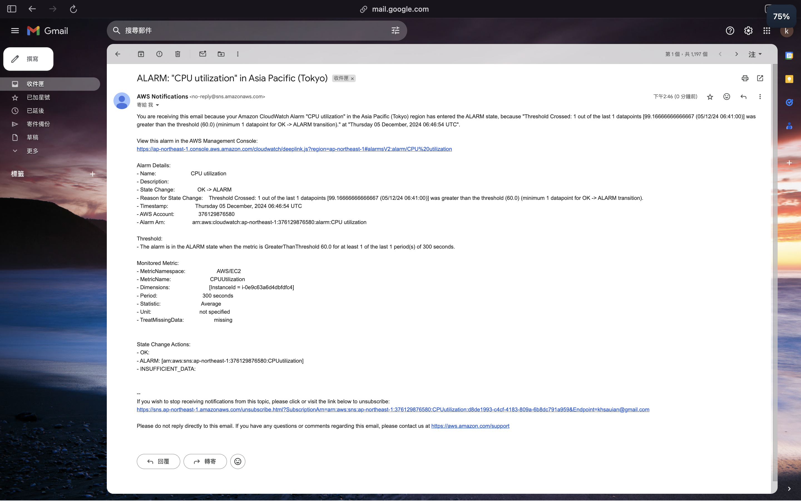

# 個人作業7 - AWS CloudWatch

## Monitor & Notification

- Region: tokyo
- 從 AWS CloudWatch Metrics 中找找看有哪些 EC2 instance 的 metrics
- 在 CloudWatch Alarms 為這台 EC2 的 CPUUtilization 建立一個 alarm
  - Average CPUUtilization Greater than 60
  - In alarm 時，透過 SNS Topic 寄送 email 到你的信箱
    
- 在 EC2 instance 上用 `stress-ng`（或其他工具）模擬 CPU 使用率，使其得以觸發 alarm

  ```
  sudo apt update
  sudo apt install stress-ng
  ```

- 觀察 EC2 的 CPUUtilization
  - `metrics.png`
    
- 觀察 AWS CloudWatch Alarm 的圖表
  - `alarm-graph.png`
    
- 觀察是否有收到信 & 截圖
  - `alarm-email.png`
    
